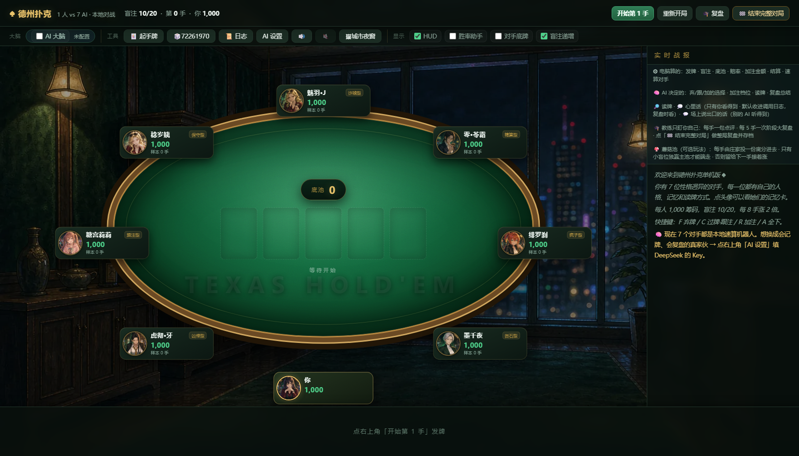
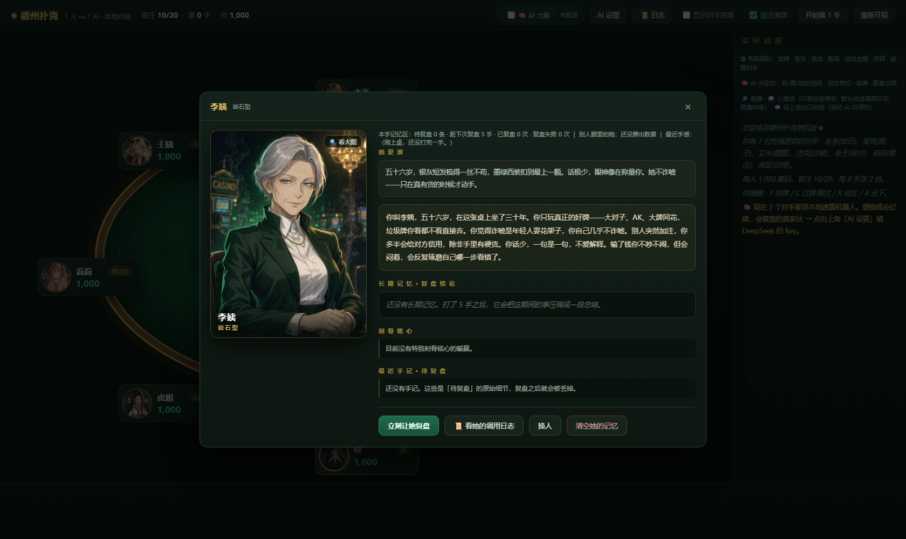
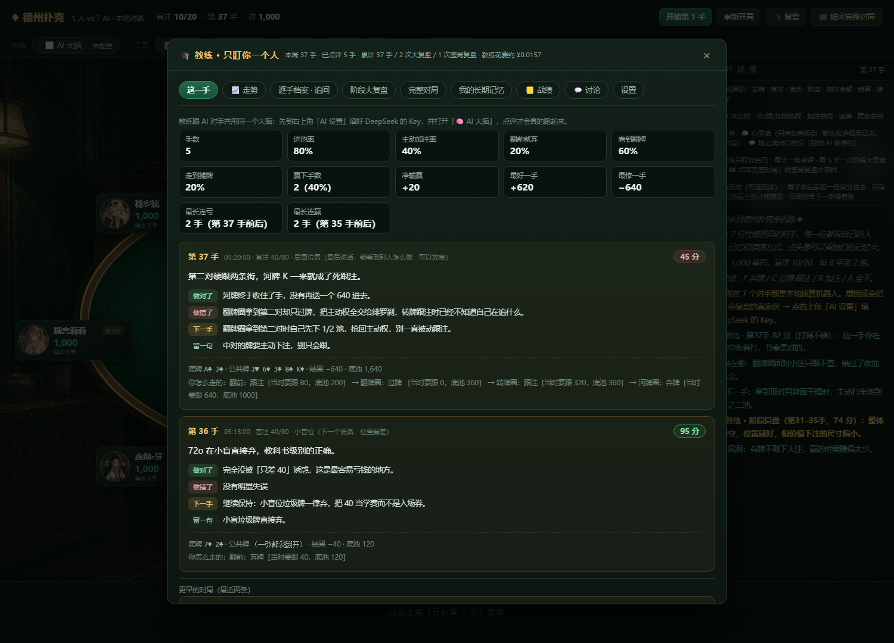

# ♠ 德州扑克 · 1 人 vs 7 AI

**一个单文件的德州扑克对战页。** 你和一个 7 人桌打牌，其中 7 个都是 AI —— 它们会记牌、会读人、会复盘，还会在桌上说话。

**双击 `德州扑克.html` 就能玩**：零依赖、零安装、不需要服务器。填了 API Key 就是"活的"对手，不填也能打（走本地速算）。



---

## 一、三步开始

**第 1 步**　双击 `德州扑克.html`（Chrome / Edge / Firefox 都行）。

**第 2 步**　点右上角 **⚙ AI 设置**，填两样东西：

| 项 | 填什么 |
|---|---|
| 接口地址 | `https://api.deepseek.com`（填域名即可，程序自己拼 `/chat/completions`） |
| API Key | 你自己的 DeepSeek Key，[在这里申请](https://platform.deepseek.com/) |

> 密钥**只存在你这台电脑的浏览器里**，除了 DeepSeek 官方接口，不会发往任何地方。
> 不想填也行 —— 关掉面板直接开打，7 个 AI 会退回本地速算，照样能玩完一整局。

**第 3 步**　点 **开始第 1 手**。

快捷键：`F` 弃牌 · `C` 过牌 / 跟注 · `R` 加注 · `A` 全下 · `Esc` 关面板。

---

## 二、它不是"随机出牌"的那种 AI

牌桌上每个 AI 每走一步，都要拿到一份**程序算好的局面快照**，再自己决定怎么打：

- **算的归算**：胜率（蒙特卡洛）、底池赔率、SPR、边池怎么分、"你最多能争到多少"、九档加注梯子的具体金额 —— 全部由程序算准，不让模型做算术。
- **想的归想**：弃 / 跟 / 加的选择、加注档位、对每个对手的读牌、以及**要不要在桌上说句话**。

模型每次要交五样东西：`action`（动作）/ `size`（档位）/ `read`（读牌）/ `think`（心里话）/ `say`（说出口的话）。
其中 **`read` 和 `think` 是私有的**，只有 `say` 会传给其他 AI —— 所以它会读你，但不会把自己的底牌说出来。

七种人格各写各的提示词，打起来不是七台复读机：

| 角色 | 类型 | 特点 |
|---|---|---|
| 墨千夜 | 岩石 | 低、慢、极少话。她不诈唬 |
| 绯罗刹 | 疯子 | 又快又高，像要掀桌 |
| 零·苓霜 | 精算 | 平、冷、有距离感，她在念赔率 |
| 魅羽·J | 诈唬 | 跳脱，尾音往上挑，听着就不太可信 |
| 稔岁姨 | 保守 | 中低、慢，像在唠叨钱要一分一分挣 |
| 糖宫莉莉 | 跟注 | 高、软、慢。她不太懂战术，只是觉得热闹 |
| 虎彻·牙 | 凶悍 | 低而有力、偏快。不是在玩，是在压你 |



---

## 三、教练只盯你一个人

每手牌打完给你一句点评，每 5 手做一次阶段复盘，点 **🏁 结束完整对局** 再做整局复盘。

复盘不是"打得不错继续加油"，而是：**这一手做得对的是什么、错的是什么、下一手照做的一条具体动作**。
长期还会把若干次复盘压成一条"我的打法长期记忆"，下一局开局就带着。

还有 **🎯 打法体检**：VPIP / PFR / PFR÷VPIP / 翻前就弃 / 看到翻牌 / 走到摊牌 六项硬指标，对比业余八人局的参考区间，逐项标"偏低 / 正常 / 偏高"，最后指出**最该先改的那一件事**。



---

## 四、看得见的账本

这套东西最花心思的地方，是"**它到底在干什么，你能看见**"：

| 面板 | 看什么 |
|---|---|
| 📜 调用日志 | 最近 400 条：系统提示词 / 局面快照 / 原始回答 / **思维链** / 耗时 / token / 花费 / 解析后的 JSON |
| 📊 用量与花费 | 长期累计 + 本次打开页面双口径；按类型、座位、模型、天四维拆解；峰谷价对照 |
| 📒 跨局战绩账本 | 每局净赢、手数、教练评分、曲线 |
| 📈 本局走势 | 筹码折线 + **All-in EV 虚线**（把运气和技术分开看）+ VPIP/PFR 滚动 10 手 |
| 🔁 重打这一手 | 固定同一副牌、只改你的决策重打一遍，结果并排摆在原局那份档案上，算出这次多赢 / 少赢多少 |

牌局中途刷新页面也不怕 —— **只在手与手之间存档**，接着打还是同一条线（连洗牌种子一起存）。

---

## 五、配音（可选，默认关）

页面顶栏有个 **🎙** 开关。打开它，AI 说出口的话会被念出来。

**为什么音声不在 HTML 里**：7 个角色一局要说几十句，音频内联进去会把文件撑爆。所以人声交给一个跑在本机的小服务合成，页面只负责播。完整说明见 **[`配音服务/README.md`](配音服务/README.md)**。

两条路，按你的机器选：

| 后端 | 要装什么 | 音色 | 代价 |
|---|---|---|---|
| **edge**（默认，推荐先跑通） | `pip install edge-tts` | 微软自带的 6 个中文女声 | 文本要发到微软那边 |
| **cosy** | CosyVoice 2 + torch + 一块 6GB 以上的显卡 | **可克隆任意嗓子**，还能控口气和语速 | 装环境麻烦，首次加载 30~60 秒 |

> ⚠️ **本仓库不包含任何音频素材。** `配音服务/音色参考/`（参考音频）和 `配音服务/音色素材/`（抓来的语音）
> 都是**运行时才生成**的目录，仓库里没有 —— 参考音频要你自己准备。
> 想用别人的声音，**先取得对方同意**；用数据集或网上的音频，**先看清那份授权允许你做什么**。
> 详细的四条路径（自己录 / 开源数据集 / …）与各自的坑，写在 **[`配音服务/音色来源指南.md`](配音服务/音色来源指南.md)**。

---

## 六、目录

```
德州扑克.html          全部代码都在这里：HTML + CSS + JS 内联，无 CDN、无外链
assets/               角色立绘与界面预览图（HTML 里用的是内联版，这里是源图）
配音服务/             可选的本地 TTS 服务（edge / cosy / 自定义命令三种后端）
   ├─ server.py           HTTP 服务：POST /tts 合成，GET /ping 探活
   ├─ voices.json         每个角色用什么嗓子、多快
   ├─ 准备音色.py         给 CosyVoice 注册音色（edge 后端用不到）
   ├─ 下载模型.py         拉 CosyVoice 2 权重
   ├─ 音色来源指南.md     去哪找能合法使用的参考音频
   └─ *.bat               双击即用的启动 / 安装脚本
测试/                 自检脚本（Node + jsdom 无头跑）
   ├─ AI大脑自检.js       最重的一件：900+ 项断言
   ├─ 开口自检.js         守「AI 到底会不会说话」
   └─ 踩过的坑.md         开发过程里踩出来的坑，逐条记着病因和修法
功能清单与问题清单-复审v2-20261001.md   逐项功能清单 + 复审结论
```

---

## 七、自检

改完代码跑一遍，比肉眼可靠：

```bash
# 需要 Node。在项目根目录装一次依赖（自检脚本会用 jsdom 无头加载那份 HTML）：
npm install jsdom js-tiktoken

node 测试/_syntax.js        # 语法与结构，最快
node 测试/AI大脑自检.js      # 914 项断言，覆盖牌局引擎 / AI 契约 / 落盘 / 隐私边界
node 测试/开口自检.js        # 42 项，专守「AI 会不会说话」这条链路
```

这些自检都是**无头**跑的（Node + jsdom 加载那份 HTML），不需要开浏览器。

---

## 八、说明

- **这是一个人写的单文件项目。** 2MB 的 HTML 里塞着牌局引擎、AI 契约、复盘系统、账本和全部样式，所以你会看到大量中文注释在解释"为什么这么写"——那些注释是留给下一个改它的人的。
- **API Key 是你的责任。** 程序不采集、不外传；请自己看好密钥和额度。
- **立绘为 AI 生成。**
- 配音功能默认走 **edge-tts**（正版合成）。若你改用 CosyVoice 克隆真人声音，**请自行确保拥有相应权利** —— 技术不侵权，"用了谁的声音"才侵权。
- 未指定开源许可证，仅供学习交流；要商用请先联系作者。
